# Portarias e Normativos de Contratações de TIC (Lei nº 14.133/2021)

Mapeamento visual e estruturado das principais normas, decretos, instruções normativas e portarias federais aplicáveis às contratações de **Tecnologia da Informação e Comunicação (TIC)** no setor público, fundamentadas na Nova Lei de Licitações e Contratos (**Lei nº 14.133/2021**).

---

```mermaid
flowchart TB
    Centro(("Referências para licitações e <br>contratos administrativos<br>Lei nº 14.133/2021")) --> DE["Dispensa Eletrônica"] & TR["Termo de Referência Digital"] & ETP["Estudo Técnico Preliminar Digital"] & PP["Pesquisa de Preços"] & EC["Entes de Contratação"] & Cred["Credenciamento"] & Gov["Governança nas Contratações"] & TIC["Soluções de Tecnologia da Informação e Comunicação TIC"]
    DE --> IN67{{"Normativa IN 67/2021"}}
    TR --> IN81{{"Normativa IN 81/2022"}}
    ETP --> IN58{{"Normativa IN 58/2022"}}
    PP --> IN65{{"Normativa IN 65/2021"}}
    EC --> D10947{{"Decreto nº 10.947/2022"}}
    Cred --> D11246{{"Decreto nº 11.246/2022"}}
    Gov --> D10193{{"Decreto nº 10.193/2019"}} & P8678{{"Portaria SEGES/MGI nº 8.678/2021"}}
    TIC --> IN94{{"Instrução Normativa SGD/ME nº 94/2022"}} & P938{{"Portaria SEGES/ME nº 938/2022"}} & P2715{{"Portaria SGD/MGI nº 2.715/2023"}} & P5950{{"Portaria SGD/MGI nº 5.950/2023"}} & P1070{{"Portaria SGD/MGI nº 1.070/2023"}}
    IN94 --> N1["Regula a <b>contratação de TIC</b> no setor público"]
    P938 --> N2["Normas específicas para uso de <b>catálogo Eletrônico</b>"]
    P2715 --> N3["Normas para a contratações de <b>Estações de Trabalho</b>"]
    P5950 --> N4["Normas para a contratações de Serviços de <b>Nuvem</b>"]
    P1070 --> n5["Normas para a contratações de serviços de<b> operação de infraestrutura e atendimento a usuários de TIC</b>"] & n6["Portarias <b>SGD/MGI nº 5.921 / 2026</b>; nº 6.055 / 2025; nº 6.680 / 2024;"]

    click IN94 "https://www.gov.br/governodigital/pt-br/contratacoes-de-tic/legislacao/processo-de-contratacao-de-solucoes-de-tic-regido-pela-lei-ndeg-14-133-de-2021"
    click P2715 "https://www.gov.br/governodigital/pt-br/contratacoes-de-tic/legislacao/modelo-de-contratacao-e-gestao-de-estacoes-de-trabalho"
    click P5950 "https://www.gov.br/governodigital/pt-br/contratacoes-de-tic/legislacao/modelo-de-contratacao-de-software-e-servicos-em-nuvem"
    click P1070 "https://www.gov.br/governodigital/pt-br/contratacoes-de-tic/legislacao/modelo-de-contracao-de-servicos-de-operacao-de-infraestrutura-e-de-atendimento-a-usuarios-de-tic"
    click n6 "https://www.in.gov.br/web/dou/-/portaria-sgd/mgi-n-5.921-de-22-de-julho-de-2026-721095205"
```
